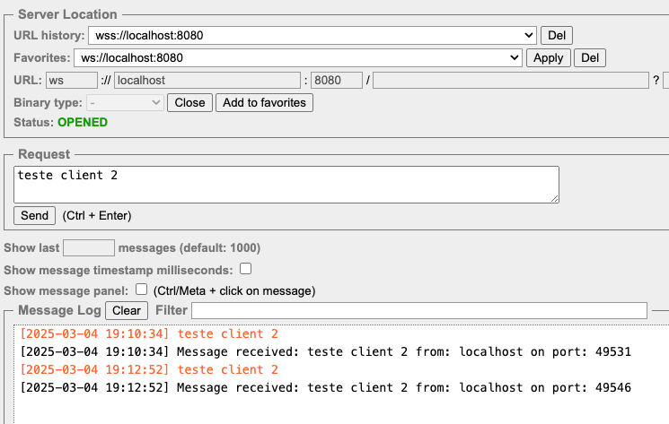
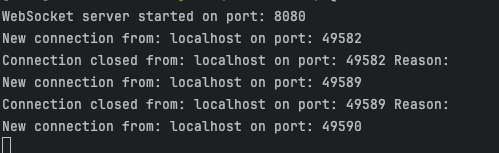

# WebSocket Server

A simple WebSocket server implemented in Java using the `java-websocket` library. This server handles multiple client connections, receives messages, and responds to them.

## 🚀 Features
- Accepts multiple WebSocket connections.
- Logs new connections and disconnections.
- Receives and echoes messages back to the sender.

## 🛠️ Requirements
- Java 23

## 📦 Installation

- Clone this repository:
```bash
git clone https://github.com/felipebabel/socket.git
```
## Running
- Build the project:
```bash
    mvn clean install  
```
- Run the WebSocket server:
```bash 
  mvn exec:java -Dexec.mainClass="socket.socket.config.Server"
```

🛠️ Testing with Simple WebSocket Client

- Install [Simple WebSocket Client](https://chromewebstore.google.com/detail/simple-websocket-client/pfdhoblngboilpfeibdedpjgfnlcodoo).
- Open the extension and enter ws://localhost:8080.
- Click Open to connect.
- Send a message and check the server logs.

Simple WebSocket Client:



Terminal: 

