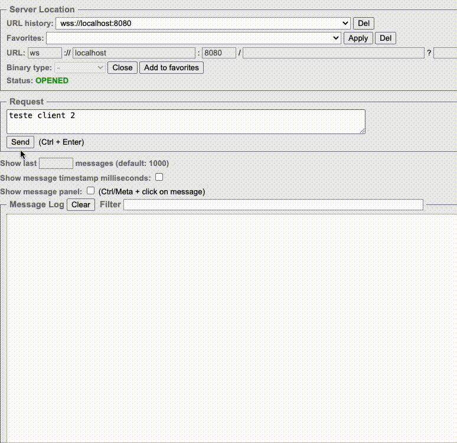

# 📡 WebSocket Server

A simple WebSocket server implemented in Java using the `java-websocket` library. This server handles multiple client connections, receives messages, and responds to them.

## 🚀 Features
- Accepts multiple WebSocket connections.
- Logs new connections and disconnections.
- Receives and echoes messages back to the sender.
---
## 🛠️ Requirements

Java 23

---
## 📦 Installation

Clone this repository:
```bash
git clone https://github.com/felipebabel/socket.git
```
---
## 🚀 Running the Server

Build the project:
```bash
    mvn clean install  
```
Run the WebSocket server:
```bash 
mvn exec:java -Dexec.mainClass="socket.config.Server"
```

By default, the server runs on:
```arduino 
ws://localhost:8080
```

## 🧪 Testing the Server

You can use the Simple WebSocket Client Chrome extension:

- Install [Simple WebSocket Client](https://chromewebstore.google.com/detail/simple-websocket-client/pfdhoblngboilpfeibdedpjgfnlcodoo).
- Open the extension and enter the WebSocket URL://localhost:8080.
- Click `Open` to connect.
- Type a message and check the server logs.

---
## 🔄 Testing Multiple Clients
To test multiple clients at once:

- Open the WebSocket client extension in two different browser tabs (or windows)
- Connect both to ws://localhost:8080
- Send a message from one tab and watch how only that tab receives an echo (the server echoes back to the sender only)
- The server logs each connection and disconnection separately
---

## 🎥 Demo

Here’s a quick demonstration of the WebSocket server in action:



